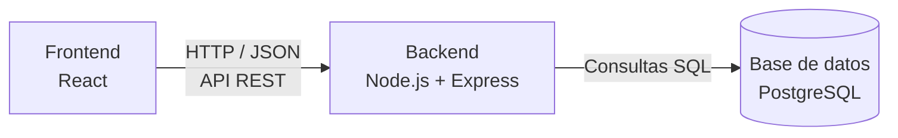

# Arquitectura del Proyecto — Sistema de Gestión para Gimnasios

## Arquitectura elegida

El sistema sigue una arquitectura **cliente-servidor de tres capas**, con separación clara entre presentación, lógica de negocio y persistencia:

