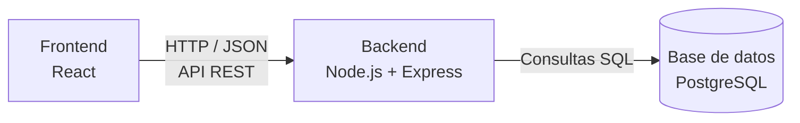

# Arquitectura del Proyecto — Sistema de Gestión para Gimnasios

## Arquitectura elegida

El sistema sigue una arquitectura **cliente-servidor de tres capas**, con separación clara entre presentación, lógica de negocio y persistencia:

- **Capa de presentación (Frontend):** React. Consume la API del backend mediante peticiones HTTP y renderiza el Panel Administrador y el Panel del Alumno.
- **Capa de lógica de negocio (Backend):** Node.js + Express, expuesto como una API REST. Organizado internamente por capas:
  - **Rutas** — definen los endpoints disponibles.
  - **Controladores** — reciben la petición y coordinan la respuesta.
  - **Servicios** — contienen la lógica de negocio (ej. cálculo de vencimientos, validación de check-in duplicado).
  - **Modelos / acceso a datos** — comunicación con PostgreSQL.
- **Capa de persistencia (Base de datos):** PostgreSQL, con el esquema relacional definido en [`/database/schema.sql`](../database/schema.sql).

## Desiciones

- **Separación de responsabilidades:** cada capa puede modificarse o reemplazarse sin afectar directamente a las demás (por ejemplo, cambiar el frontend sin tocar el backend).
- **Mantenibilidad:** organizar el backend en capas (rutas/controladores/servicios) facilita ubicar y corregir código a medida que el sistema crezca.
- **Despliegue independiente:** cada capa se aloja en un servicio distinto en la nube, lo que permite escalar o actualizar una sin afectar a las otras.
