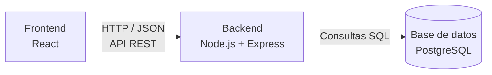

# Arquitectura del Proyecto — Sistema de Gestión para Gimnasios

## Arquitectura elegida

El sistema sigue una arquitectura **cliente-servidor de tres capas**, con separación clara entre presentación, lógica de negocio y persistencia:

```mermaid
flowchart LR
    A[Frontend<br/>React] -->|HTTP / JSON<br/>API REST| B[Backend<br/>Node.js + Express]
    B -->|Consultas SQL| C[(Base de datos<br/>PostgreSQL)]
```

- **Capa de presentación (Frontend):** React. Consume la API del backend mediante peticiones HTTP y renderiza el Panel Administrador y el Panel del Alumno.
- **Capa de lógica de negocio (Backend):** Node.js + Express, expuesto como una API REST. Organizado internamente por capas:
  - **Rutas** — definen los endpoints disponibles.
  - **Controladores** — reciben la petición y coordinan la respuesta.
  - **Servicios** — contienen la lógica de negocio.
  - **Modelos / acceso a datos** — comunicación con PostgreSQL.
- **Capa de persistencia (Base de datos):** PostgreSQL, con el esquema relacional definido en [`/database/schema.sql`](../database/schema.sql).

## Decisiones

- **Separación de responsabilidades:** cada capa puede modificarse o reemplazarse sin afectar directamente a las demás (por ejemplo, cambiar el frontend sin tocar el backend).
- **Mantenibilidad:** organizar el backend en capas (rutas/controladores/servicios) facilita ubicar y corregir código a medida que el sistema crezca.
- **Despliegue independiente:** cada capa se aloja en un servicio distinto en la nube, lo que permite escalar o actualizar una sin afectar a las otras.

## Tecnologías 

| Capa | Tecnología |
|---|---|
| Frontend | React |
| Backend | Node.js + Express (API REST) |
| Base de datos | PostgreSQL |
| Control de versiones | Git + GitHub |

## Comunicación entre capas

El frontend se comunica con el backend exclusivamente a través de una API REST. El backend es el único componente con acceso directo a la base de datos — el frontend nunca consulta PostgreSQL de forma directa, lo que mantiene la lógica de negocio y las validaciones centralizadas del lado del servidor.

## Seguridad

El acceso del alumno es por código simple sin contraseña, y el personal administrativo opera sin distinción de roles. No se gestionan datos de tarjetas ni información sensible más allá de la ficha de salud declarada. La incorporación de autenticación con contraseña para el staff queda planteada como mejora futura, fuera del alcance del MVP.

## Despliegue

El despliegue de la aplicación —previsto en Vercel (frontend), Render o Railway (backend) y Railway o Supabase (base de datos PostgreSQL)— se definirá de manera definitiva en etapas posteriores, dando cumplimiento al Requerimiento No Funcional RNF04 (Disponibilidad), el cual exige garantizar la accesibilidad continua del sistema mediante servicios de hosting en la nube, sin condicionar la arquitectura a un proveedor tecnológico específico en esta fase.

## Métricas operativas (propuestas)

- Cantidad de alumnos activos / por vencer / vencidos (en tiempo real, vía Dashboard).
- Tiempo de respuesta promedio de los endpoints principales (objetivo: < 2s).
- Tasa de errores de la API.
- Cantidad de sugerencias de IA generadas vs. aprobadas por semana.

## Lineamientos de despliegue

- Variables de entorno (credenciales de base de datos, puertos) gestionadas fuera del código fuente, mediante archivos .env no versionados.
- El backend se despliega como servicio independiente del frontend, permitiendo actualizar uno sin reconstruir el otro.
- La base de datos mantiene backups automáticos provistos por el servicio de hosting elegido.
- Ver diagrama de despliegue candidato en [`docs/diagrama_despliegue.md`](./diagrama_despliegue.md).