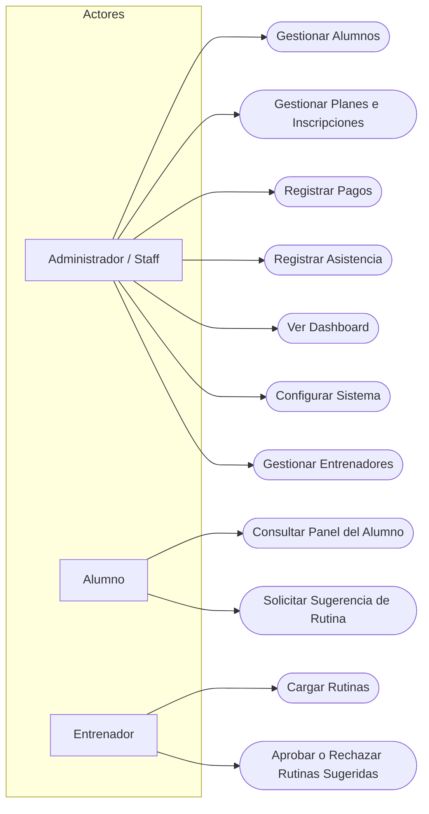

# Casos de Uso — Sistema de Gestión para Gimnasios

## Actores

- **Administrador/Staff** — personal del gimnasio, opera el Panel Administrador.
- **Alumno** — consulta el Panel del Alumno.
- **Entrenador** — carga rutinas y aprueba sugerencias del Asistente de IA.

## Diagrama de Casos de Uso

## Listado de Casos de Uso

| ID | Nombre | Actor | RF relacionado |
|---|---|---|---|
| UC01 | Gestionar Alumnos | Administrador | RF01, RF02, RF09, RF15 |
| UC02 | Gestionar Planes e Inscripciones | Administrador | RF03, RF04, RF05 |
| UC03 | Registrar Pagos | Administrador | RF06, RF14 |
| UC04 | Registrar Asistencia | Administrador | RF07 |
| UC05 | Ver Dashboard | Administrador | RF08 |
| UC06 | Configurar Sistema | Administrador | RF16 |
| UC07 | Gestionar Entrenadores | Administrador | RF17 |
| UC08 | Consultar Panel del Alumno | Alumno | RF10, RF19 |
| UC09 | Solicitar Sugerencia de Rutina | Alumno | RF12 |
| UC10 | Cargar Rutinas | Entrenador | RF11, RF18 |
| UC11 | Aprobar o Rechazar Rutinas Sugeridas | Entrenador | RF13, RF18 |

## Especificación detallada de los casos de uso principales

### UC03 — Registrar Pagos
- **Actor:** Administrador
- **Precondición:** El alumno tiene una inscripción existente.
- **Flujo principal:**
  1. El administrador busca al alumno.
  2. Ingresa monto, fecha y método de pago.
  3. El sistema calcula la nueva fecha de vencimiento (RN02, RN03, RN04).
  4. El sistema confirma el registro.
- **Flujo alternativo:** Si el alumno no tiene inscripción activa, el sistema solicita primero inscribirlo (UC02).

### UC09 — Solicitar Sugerencia de Rutina
- **Actor:** Alumno
- **Precondición:** El alumno tiene ficha de salud cargada.
- **Flujo principal:**
  1. El alumno solicita una sugerencia desde el Panel del Alumno.
  2. El sistema filtra el banco de rutinas según su ficha de salud (RN18, RN20).
  3. El sistema crea la sugerencia en estado `pendiente`.
  4. El alumno recibe el mensaje de que la sugerencia está sujeta a aprobación del entrenador (RN23).
- **Flujo alternativo:** Si no hay rutinas compatibles, el sistema informa que no hay sugerencias disponibles.

### UC11 — Aprobar o Rechazar Rutinas Sugeridas
- **Actor:** Entrenador
- **Precondición:** Existe al menos una rutina en estado `pendiente` (requiere RN24: entrenador registrado).
- **Flujo principal:**
  1. El entrenador revisa las sugerencias pendientes.
  2. Aprueba o rechaza cada una.
  3. El sistema actualiza el estado y registra el entrenador y la fecha de validación.
- **Flujo alternativo:** Si rechaza, la rutina no queda visible para el alumno (RN21).