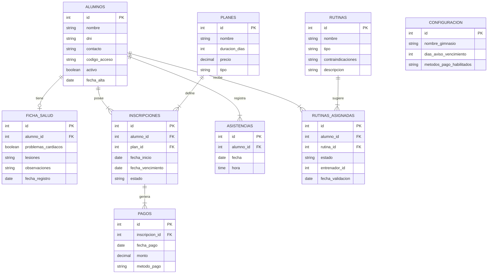

# Diagrama Entidad-Relación — Sistema de Gestión para Gimnasios

Diagrama construido con sintaxis Mermaid.

## Entidades y relaciones

- **alumnos** — entidad central del sistema. Un alumno tiene una ficha_salud, puede tener varias inscripciones a lo largo del tiempo, varios registros de asistencias, y varias rutinas_asignadas.
- **ficha_salud** — relación 1 a 1 con alumnos. Guarda los datos de salud declarados, usados para filtrar rutinas seguras.
- **planes** — catálogo de planes disponibles (mensual, trimestral, por clases, etc.), independiente de los alumnos.
- **inscripciones** — relaciona un alumno con un plan en un período determinado, con su fecha de vencimiento y estado.
- **pagos** — cada pago pertenece a una inscripción; un alumno puede tener muchos pagos a lo largo del tiempo (historial completo, ver RF14).
- **asistencias** — un registro por cada check-in de un alumno.
- **rutinas** — banco de rutinas predefinidas, cargadas por el entrenador, con sus contraindicaciones.
- **rutinas_asignadas** — relaciona una rutina con un alumno, con su estado de aprobación (pendiente / aprobada / rechazada).
- **configuracion** — tabla de parámetros generales del sistema, sin relación directa con las demás entidades.

## Cardinalidades principales

| Relación | Cardinalidad |
|---|---|
| alumnos → ficha_salud | 1 a 1 |
| alumnos → inscripciones | 1 a muchos |
| planes → inscripciones | 1 a muchos |
| inscripciones → pagos | 1 a muchos |
| alumnos → asistencias | 1 a muchos |
| alumnos → rutinas_asignadas | 1 a muchos |
| rutinas → rutinas_asignadas | 1 a muchos |
