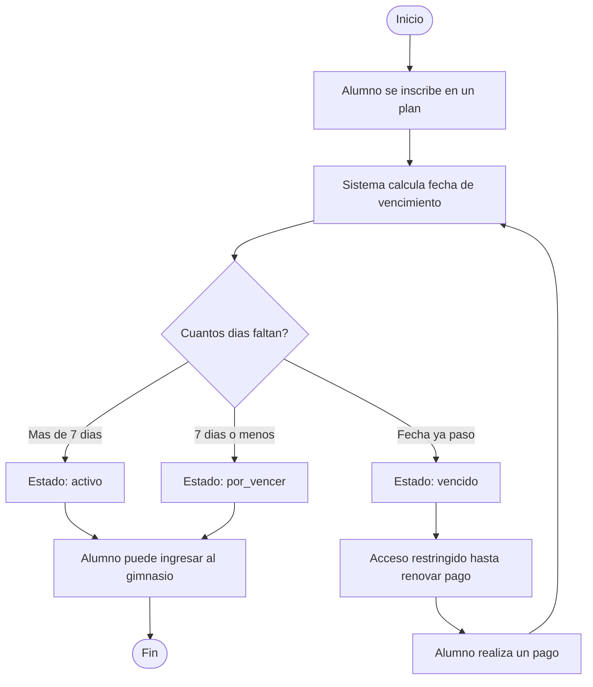

# Diagramas de Actividades — Sistema de Gestión para Gimnasios

## 1. Control de vencimiento de inscripción


## 2. Aprobación de rutina sugerida por el Asistente de IA

```mermaid
flowchart TD
    Start([Inicio]) --> A[Alumno solicita sugerencia de rutina]
    A --> B[Sistema filtra banco de rutinas segun ficha de salud]
    B --> C{Existe rutina compatible?}
    C -->|No| D[Sistema informa que no hay sugerencias disponibles]
    C -->|Si| E[Se crea rutina_asignada en estado pendiente]