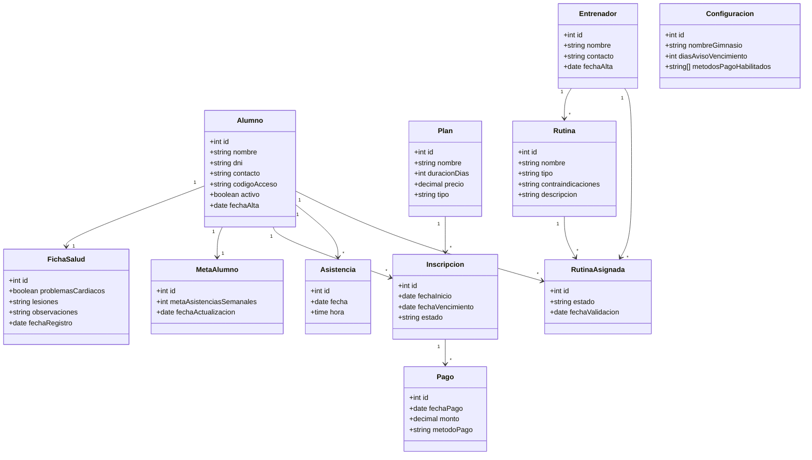

# Diagrama de Clases — Sistema de Gestión para Gimnasios

Este diagrama es la representación orientada a objetos del modelo relacional definido en [`/database/schema.sql`](../database/schema.sql) — cada clase corresponde a una tabla, y cada atributo a una columna. `Configuracion` no participa de ninguna relación, por ser una entidad de parámetros globales del sistema.