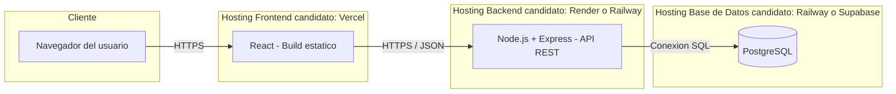

# Diagrama de Despliegue — Sistema de Gestión para Gimnasios

## Nodos y componentes

| Nodo | Componente desplegado | Comunicación |
|---|---|---|
| Hosting Frontend | Build estático de React | Servido por HTTPS al navegador del usuario |
| Hosting Backend | API REST (Node.js + Express) | Recibe peticiones HTTPS/JSON del frontend |
| Hosting Base de Datos | PostgreSQL | Recibe conexiones SQL exclusivamente del backend |

El frontend no se conecta directamente a la base de datos — toda comunicación pasa por el backend, como se detalla en [`arquitectura.md`](./arquitectura.md).