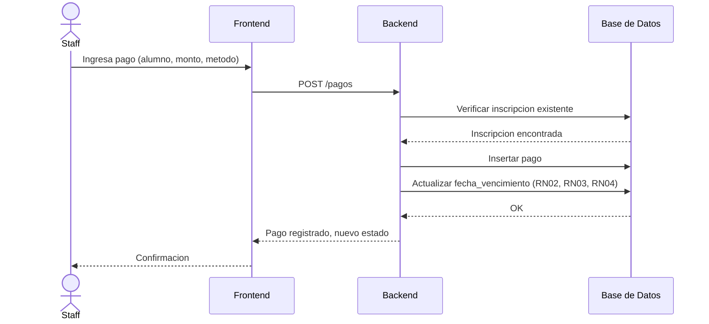
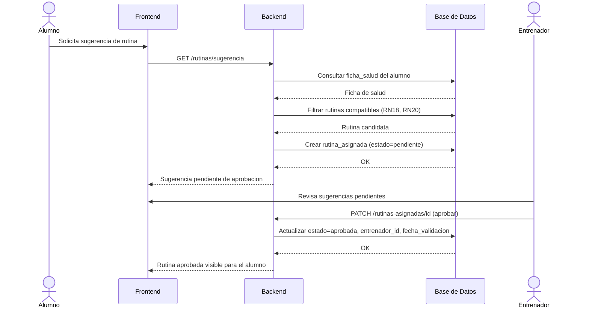
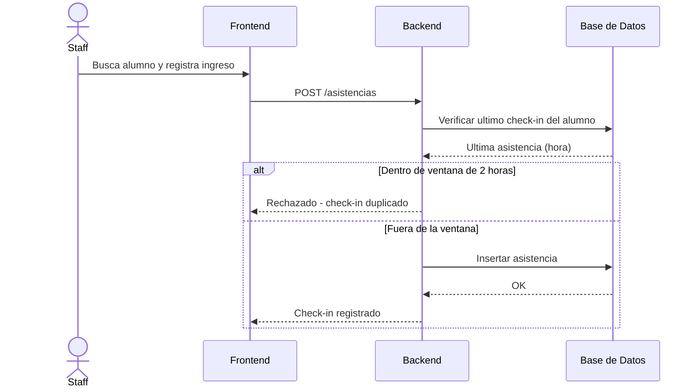

# Diagramas de Secuencia — Sistema de Gestión para Gimnasios

## 1. Registrar pago y renovar inscripción (RF06)

## 2. Alumno solicita sugerencia de rutina y entrenador la aprueba (RF12, RF13)

## 3. Check-in de asistencia con validación de duplicado (RF07, RN12)

